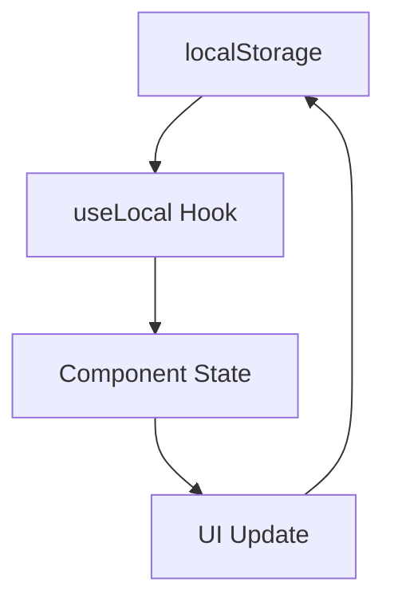
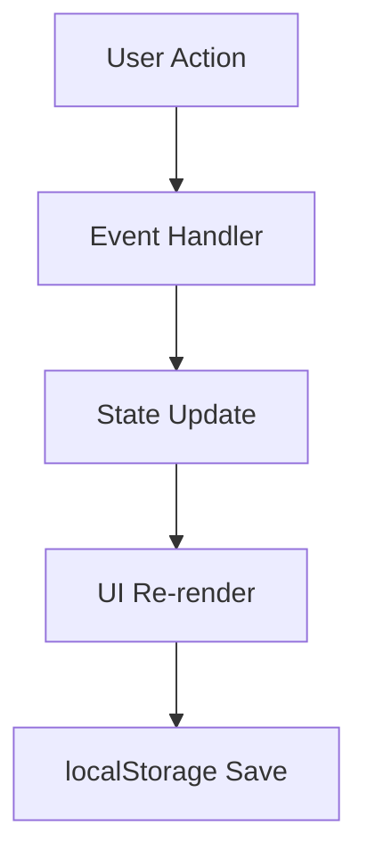

# 페이지 참조 가이드

## 📋 개요

이 문서는 클래스 플래너 애플리케이션의 각 페이지와 컴포넌트에 대한 상세한 참조 가이드입니다. 개발자와 사용자가 애플리케이션의 구조를 이해하고 효율적으로 사용할 수 있도록 도와줍니다.

---

## 🏠 **메인 페이지들**

### 📚 **Students 페이지** (`/students`)

**파일**: `src/pages/Students.tsx`

#### 🎯 **기능**

- 학생 관리 (추가, 삭제, 선택)
- 기본 과목 자동 생성
- localStorage 데이터 저장/복원

#### 🎨 **UI 구성**

- 좌측 340px 고정 너비 레이아웃
- 학생 목록 표시
- 학생 추가 폼
- 선택된 학생 시각적 표시

#### 🔧 **주요 컴포넌트**

- `StudentManagementSection` (Organism)
- `StudentInputSection` (Molecule)
- `StudentListItem` (Atom)

#### 📊 **데이터 구조**

```typescript
interface Student {
  id: string;
  name: string;
}

interface Subject {
  id: string;
  name: string;
  color: string;
}

interface Enrollment {
  id: string;
  studentId: string;
  subjectId: string;
}
```

---

### 📅 **Schedule 페이지** (`/schedule`)

**파일**: `src/pages/Schedule.tsx`

#### 🎯 **기능**

- 시간표 표시 (9:00-23:00, 30분 단위)
- 드래그 앤 드롭으로 수업 추가
- 수업 편집 및 삭제
- 학생별 필터링
- PDF 다운로드

#### 🎨 **UI 구성**

- 7일 x 시간별 그리드 레이아웃
- 플로팅 학생 패널
- 모달 시스템 (수업 추가/편집)
- PDF 다운로드 버튼

#### 🔧 **주요 컴포넌트**

- `TimeTableGrid` (Organism)
- `SessionBlock` (Molecule)
- `DropZone` (Molecule)
- `StudentPanel` (Organism)

#### 📊 **데이터 구조**

```typescript
interface Session {
  id: string;
  studentId: string;
  subjectId: string;
  weekday: number;
  startTime: string;
  endTime: string;
  classroom?: string;
}
```

#### 🆕 **최신 기능**

- **시간 범위 검증**: 시작 시간이 종료 시간보다 늦을 수 없음
- **자동 시간 조정**: 시작 시간이 종료 시간보다 늦으면 자동으로 조정
- **스크롤 가능한 모달**: 긴 내용도 모달에서 스크롤 가능
- **존재하지 않는 학생 피드백**: 모달에서 적절한 피드백 제공

---

### 📖 **Manual 페이지** (`/manual`)

**파일**: `src/pages/Manual.tsx`

#### 🎯 **기능**

- 사용자 매뉴얼 표시
- 애플리케이션 사용법 안내

#### 🎨 **UI 구성**

- 마크다운 형식의 문서 표시
- 스크롤 가능한 레이아웃

---

## 🧩 **컴포넌트 구조**

### ⚛️ **Atoms (원자)**

**위치**: `src/components/atoms/`

#### **Button** (`Button.tsx`)

- 재사용 가능한 버튼 컴포넌트
- 다양한 크기와 스타일 지원
- 클릭 이벤트 처리

#### **Input** (`Input.tsx`)

- 텍스트 입력 필드
- 플레이스홀더, 에러 상태 지원
- 키보드 이벤트 처리

#### **Label** (`Label.tsx`)

- 텍스트 라벨 컴포넌트
- 다양한 스타일링 옵션

#### **StudentListItem** (`StudentListItem.tsx`)

- 학생 목록 아이템
- 선택 상태 표시
- 삭제 버튼 포함

#### **TimeSlot** (`TimeSlot.tsx`)

- 시간 슬롯 표시
- 시간대별 스타일링

#### **WeekdayHeader** (`WeekdayHeader.tsx`)

- 요일 헤더 표시
- 요일별 스타일링

#### **ThemeToggle** (`ThemeToggle.tsx`)

- 다크/라이트 테마 전환
- 토글 버튼 UI

---

### 🔬 **Molecules (분자)**

**위치**: `src/components/molecules/`

#### **Card** (`Card.tsx`)

- 카드 형태의 컨테이너
- 헤더, 본문, 푸터 구조

#### **DropZone** (`DropZone.tsx`)

- 드래그 앤 드롭 영역
- 드롭 이벤트 처리

#### **FormField** (`FormField.tsx`)

- 폼 필드와 라벨 조합
- 에러 메시지 표시

#### **SessionBlock** (`SessionBlock.tsx`)

- 수업 세션 블록
- 클릭 이벤트 처리
- 겹침 처리

#### **StudentInputSection** (`StudentInputSection.tsx`)

- 학생 추가 입력 섹션
- 에러 메시지 처리
- 키보드 이벤트 지원

#### **TimeTableRow** (`TimeTableRow.tsx`)

- 시간표 행
- 세션 배치 로직

---

### 🦠 **Organisms (유기체)**

**위치**: `src/components/organisms/`

#### **StudentManagementSection** (`StudentManagementSection.tsx`)

- 학생 관리 전체 섹션
- 학생 목록과 추가 폼 통합

#### **TimeTableGrid** (`TimeTableGrid.tsx`)

- 시간표 그리드 전체
- 세션 배치 알고리즘
- 성능 최적화

#### **StudentPanel** (`StudentPanel.tsx`)

- 플로팅 학생 패널
- 검색 기능
- 드래그 가능

#### **SessionModal** (`SessionModal.tsx`)

- 수업 추가/편집 모달
- 폼 처리
- 유효성 검증

---

## 🔧 **유틸리티 및 라이브러리**

### 📚 **Lib 폴더**

**위치**: `src/lib/`

#### **planner.ts**

- 핵심 비즈니스 로직
- 데이터 처리 함수
- 유틸리티 함수

#### **pdf-utils.ts**

- PDF 생성 기능
- HTML to PDF 변환
- 세션 범위 기반 필터링

### 🎨 **Contexts**

**위치**: `src/contexts/`

#### **ThemeContext** (`ThemeContext.tsx`)

- 테마 상태 관리
- 다크/라이트 모드 전환
- CSS 변수 관리

---

## 🧪 **테스트 구조**

### 📁 **테스트 파일 위치**

- `src/**/__tests__/` - 각 컴포넌트별 테스트
- `src/pages/__tests__/` - 페이지별 테스트
- `src/lib/__tests__/` - 유틸리티 함수 테스트

### 🎯 **테스트 유형**

- **단위 테스트**: 개별 컴포넌트/함수 테스트
- **통합 테스트**: 페이지 전체 기능 테스트
- **E2E 테스트**: 사용자 시나리오 테스트
- **성능 테스트**: 알고리즘 성능 검증

---

## 🎨 **스타일링 시스템**

### 🎨 **CSS Modules**

- 컴포넌트별 스타일 격리
- 클래스명 자동 생성
- TypeScript 지원

### 🌙 **테마 시스템**

- CSS 변수 기반
- 다크/라이트 모드
- 동적 테마 전환

### 📱 **반응형 디자인**

- 모바일 친화적 레이아웃
- 유연한 그리드 시스템
- 브레이크포인트 기반 스타일링

---

## 📊 **데이터 플로우**

### 🔄 **상태 관리**



### 🎯 **이벤트 플로우**



---

## 🚀 **성능 최적화**

### ⚡ **알고리즘 개선**

- 세션 배치 알고리즘: O(n log n) 복잡도
- 겹침 처리 최적화
- 메모이제이션 활용

### 🎯 **렌더링 최적화**

- React.memo 사용
- 불필요한 리렌더링 방지
- 가상화 고려 (대용량 데이터)

---

## 📝 **개발 가이드**

### 🔧 **새 컴포넌트 추가**

1. Atomic Design 패턴 따라 적절한 폴더 선택
2. TypeScript 인터페이스 정의
3. CSS Modules 스타일 작성
4. 테스트 파일 생성
5. 문서 업데이트

### 🧪 **테스트 작성**

1. 컴포넌트 렌더링 테스트
2. 사용자 상호작용 테스트
3. 에러 케이스 테스트
4. 성능 테스트 (필요시)

### 📚 **문서화**

1. 컴포넌트 목적 명시
2. Props 인터페이스 설명
3. 사용 예시 제공
4. 주의사항 기록

---

## 🎯 **최신 업데이트**

### 🆕 **시간 검증 시스템**

- 시작 시간이 종료 시간보다 늦을 수 없도록 검증
- 자동 시간 조정 기능으로 사용자 편의성 향상
- 모달에서 실시간 피드백 제공

### 🆕 **모달 개선**

- 스크롤 가능한 모달로 긴 내용도 표시 가능
- 모달 크기 자동 조정
- 접근성 개선

### 🆕 **에러 처리 강화**

- 존재하지 않는 학생 추가 시 적절한 피드백
- 입력 검증 강화
- 사용자 친화적 에러 메시지

---

_이 문서는 애플리케이션의 구조와 기능을 이해하는 데 도움이 됩니다. 정기적으로 업데이트하여 최신 상태를 유지하세요._
